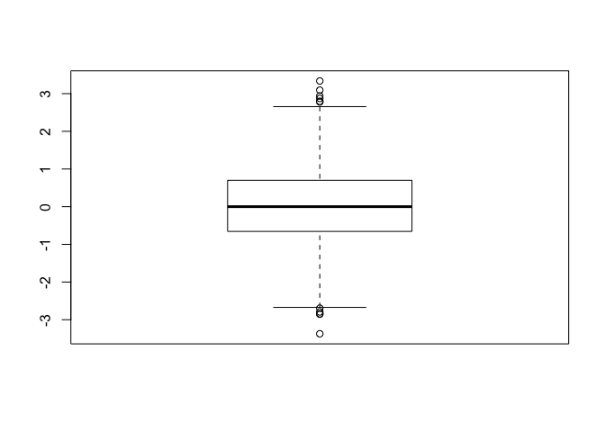
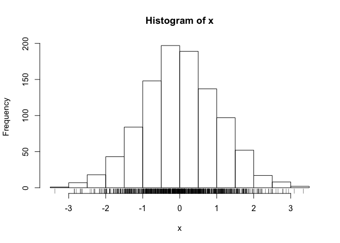
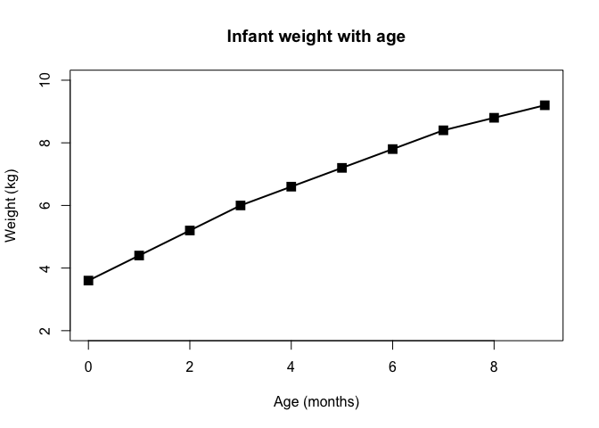
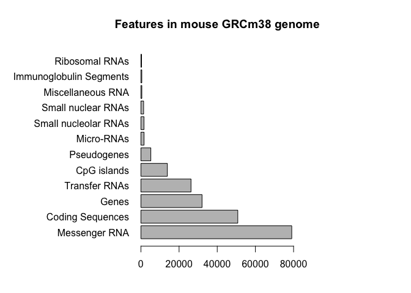
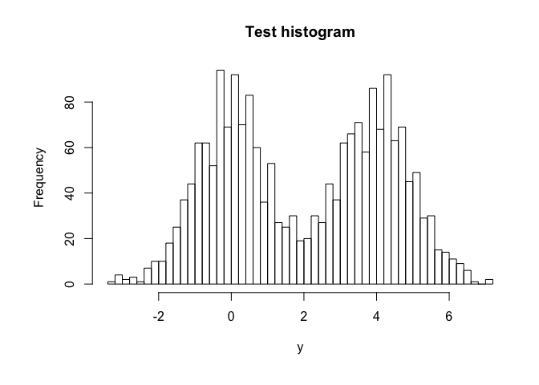
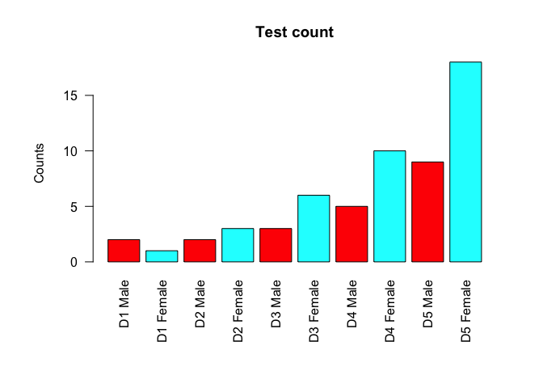

class05: Data exploration and visualization in R
================

``` r
## Class05 Data visualization


# Section 1 normal distribution
x <- rnorm(1000)

# Some summary stats
mean(x)
```

    ## [1] 0.02051527

``` r
sd(x)
```

    ## [1] 1.034281

``` r
summary(x)
```

    ##      Min.   1st Qu.    Median      Mean   3rd Qu.      Max. 
    ## -3.372765 -0.655461  0.000593  0.020515  0.700349  3.336628

``` r
# Visualizing the data
boxplot(x)
```

<!-- -->

``` r
hist(x)
rug(x)
```

<!-- -->

``` r
## Section 2 scatterplots

# Reading our input file first
weight <- read.table("bimm143_05_rstats/weight_chart.txt", header = T)

# Plotting our data
plot(weight, type = "o", pch = 15, cex = 1.5, lwd = 2, ylim = c(2,10), xlab = "Age (months)", ylab = "Weight (kg)", main = "Infant weight with age")
```

<!-- -->

``` r
## Section 2 barplots
mouse <- read.table("bimm143_05_rstats/feature_counts.txt", sep = "\t", header = T)

par(mar = c(4, 12, 4, 10))

barplot(mouse$Count, names.arg = mouse$Feature, horiz = T, las = 1, main = "Features in mouse GRCm38 genome", xlim = c(0, 80000))
```

<!-- -->

``` r
## Section 2 histograms
par(mar = c(6,6,4,2))
y <-  c(rnorm(1000), rnorm(1000)+4)
hist(y, breaks = 50, main = "Test histogram")
```

<!-- -->

``` r
## Section 3 color vectors
mf_counts <- read.delim("bimm143_05_rstats/male_female_counts.txt")
par(mar = c(8,6,4,3))
barplot(mf_counts$Count, names.arg = mf_counts$Sample, las = 2, ylab = "Counts", col = rainbow(2), main = "Test count")
```

<!-- -->
