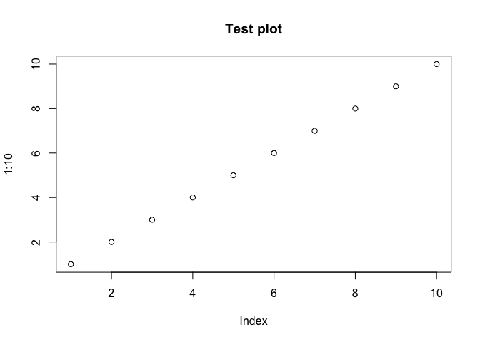

class06 R functions
================
Darren Lam
10/17/2019

This is my work from class06 in **BIMM 143**.

# Using code chunks

``` r
# Demoing a code chunk

plot(1:10, main = "Test plot")
```

<!-- -->

# Practice reading files (again…)

Reading comma-separated files

``` r
read.csv("test1.txt", header = T)
```

    ##   Col1 Col2 Col3
    ## 1    1    2    3
    ## 2    4    5    6
    ## 3    7    8    9
    ## 4    a    b    c

Reading $-separated files

``` r
read.table("test2.txt", sep = "$", header = T)
```

    ##   Col1 Col2 Col3
    ## 1    1    2    3
    ## 2    4    5    6
    ## 3    7    8    9
    ## 4    a    b    c

Reading space-separated files

``` r
read.table("test3.txt", col.names = c("Col1", "Col2", "Col3"))
```

    ##   Col1 Col2 Col3
    ## 1    1    6    a
    ## 2    2    7    b
    ## 3    3    8    c
    ## 4    4    9    d
    ## 5    5   10    e

# Writing a simple function

Writing an add function

``` r
add <- function(x, y = 1) {x + y}
```

Playing with our add function

``` r
add(1)
```

    ## [1] 2

``` r
add(x=1, y=4)
```

    ## [1] 5

``` r
add( c(1,2,3) )
```

    ## [1] 2 3 4

``` r
add( c(1,2,3), 4 )
```

    ## [1] 5 6 7

# Writing a more interesting function

Writing a rescale function

``` r
rescale <- function(x) {
   rng <-range(x)
   (x - rng[1]) / (rng[2] - rng[1])
}
```

**Test 1:** A small example where we know the
    answer

``` r
rescale(1:10)
```

    ##  [1] 0.0000000 0.1111111 0.2222222 0.3333333 0.4444444 0.5555556 0.6666667
    ##  [8] 0.7777778 0.8888889 1.0000000

**Test 2:** How would we get our function to work here..?

``` r
rescale( c(1,2,NA,3,10) )
```

    ## [1] NA NA NA NA NA

**Solution:** We have our range function remove NA values by modifying
the arguments

``` r
rescale2 <- function(x) {
   rng <-range(x, na.rm = T)
   (x - rng[1]) / (rng[2] - rng[1])
}

rescale2( c(1,2,NA,3,10) )
```

    ## [1] 0.0000000 0.1111111        NA 0.2222222 1.0000000

# Section 2 of hands-on sheet

Install the **bio3d** package for sequence and structure analysis

``` r
#install.packages("bio3d")
```

``` r
library(bio3d)
s1 <- read.pdb("4AKE")  # kinase with drug
```

    ##   Note: Accessing on-line PDB file

``` r
s2 <- read.pdb("1AKE")  # kinase no drug
```

    ##   Note: Accessing on-line PDB file
    ##    PDB has ALT records, taking A only, rm.alt=TRUE

``` r
s3 <- read.pdb("1E4Y")  # kinase with drug
```

    ##   Note: Accessing on-line PDB file

``` r
s1.chainA <- trim.pdb(s1, chain="A", elety="CA")
s2.chainA <- trim.pdb(s2, chain="A", elety="CA")
s3.chainA <- trim.pdb(s3, chain="A", elety="CA")

s1.b <- s1.chainA$atom$b
s2.b <- s2.chainA$atom$b
s3.b <- s3.chainA$atom$b

plotb3(s1.b, sse=s1.chainA, typ="l", ylab="Bfactor")
```

<!-- -->

``` r
plotb3(s2.b, sse=s2.chainA, typ="l", ylab="Bfactor")
```

<!-- -->

``` r
plotb3(s3.b, sse=s3.chainA, typ="l", ylab="Bfactor")
```

<!-- -->

## Documentation:

**comments on what are the inputs to the function:** The inputs to the
function are PDB files.

**what the function does and how to use it:** This function
