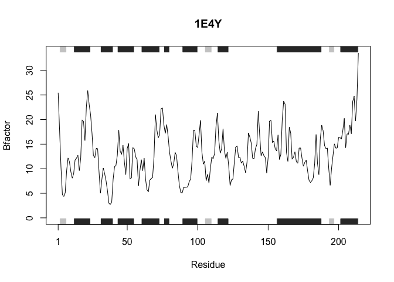

class06\_HW
================
Darren Lam
10/22/2019

This is my R function optimization practice for BIMM 143 **Class 06**.

# Improving this analysis code

``` r
library(bio3d)
s1 <- read.pdb("4AKE")  # kinase with drug
```

    ##   Note: Accessing on-line PDB file

``` r
s2 <- read.pdb("1AKE")  # kinase no drug
```

    ##   Note: Accessing on-line PDB file
    ##    PDB has ALT records, taking A only, rm.alt=TRUE

``` r
s3 <- read.pdb("1E4Y")  # kinase with drug
```

    ##   Note: Accessing on-line PDB file

``` r
s1.chainA <- trim.pdb(s1, chain="A", elety="CA")
s2.chainA <- trim.pdb(s2, chain="A", elety="CA")
s3.chainA <- trim.pdb(s1, chain="A", elety="CA")

s1.b <- s1.chainA$atom$b
s2.b <- s2.chainA$atom$b
s3.b <- s3.chainA$atom$b

plotb3(s1.b, sse=s1.chainA, typ="l", ylab="Bfactor")
```

<!-- -->

``` r
plotb3(s2.b, sse=s2.chainA, typ="l", ylab="Bfactor")
```

<!-- -->

``` r
plotb3(s3.b, sse=s3.chainA, typ="l", ylab="Bfactor")
```

<!-- -->

## Step 1: Removing copy and paste errors

``` r
library(bio3d)
s1 <- read.pdb("4AKE")  # kinase with drug
```

    ##   Note: Accessing on-line PDB file

    ## Warning in get.pdb(file, path = tempdir(), verbose = FALSE): /var/folders/
    ## v_/q3ytvwzx43jglkydxrd6wdl80000gn/T//RtmpsHUhab/4AKE.pdb exists. Skipping
    ## download

``` r
s2 <- read.pdb("1AKE")  # kinase no drug
```

    ##   Note: Accessing on-line PDB file

    ## Warning in get.pdb(file, path = tempdir(), verbose = FALSE): /var/folders/
    ## v_/q3ytvwzx43jglkydxrd6wdl80000gn/T//RtmpsHUhab/1AKE.pdb exists. Skipping
    ## download

    ##    PDB has ALT records, taking A only, rm.alt=TRUE

``` r
s3 <- read.pdb("1E4Y")  # kinase with drug
```

    ##   Note: Accessing on-line PDB file

    ## Warning in get.pdb(file, path = tempdir(), verbose = FALSE): /var/folders/
    ## v_/q3ytvwzx43jglkydxrd6wdl80000gn/T//RtmpsHUhab/1E4Y.pdb exists. Skipping
    ## download

``` r
s1.chainA <- trim.pdb(s1, chain="A", elety="CA")
s2.chainA <- trim.pdb(s2, chain="A", elety="CA")
s3.chainA <- trim.pdb(s3, chain="A", elety="CA") # s1 changed to s3 in argument

s1.b <- s1.chainA$atom$b
s2.b <- s2.chainA$atom$b
s3.b <- s3.chainA$atom$b

plotb3(s1.b, sse=s1.chainA, typ="l", ylab="Bfactor")
```

<!-- -->

``` r
plotb3(s2.b, sse=s2.chainA, typ="l", ylab="Bfactor")
```

<!-- -->

``` r
plotb3(s3.b, sse=s3.chainA, typ="l", ylab="Bfactor")
```

<!-- -->

## Step 2: Simplify to work with a generic vector named “x”

``` r
library(bio3d)
  
  x <- read.pdb("4AKE")
```

    ##   Note: Accessing on-line PDB file

    ## Warning in get.pdb(file, path = tempdir(), verbose = FALSE): /var/folders/
    ## v_/q3ytvwzx43jglkydxrd6wdl80000gn/T//RtmpsHUhab/4AKE.pdb exists. Skipping
    ## download

``` r
  x.chainA <- trim.pdb(x, chain = "A", elety = "CA")
  
  x.b <- x.chainA$atom$b
  
  plotb3(x.b, sse = x.chainA, typ = "l", ylab = "Bfactor")
```

<!-- -->

## Step 3: Turn it into a function — plot.bfac()

``` r
#plot.bfac allows you to plot the B-factor for each amino acid residue in a protein's A chain.

plot.bfac <- function(x) {  # input is PDB accession number
  
  y <- read.pdb(x)  # PDB file is read
  
  # variables assigned to amino acid residues and associated B-factors
  y.chainA <- trim.pdb(y, chain = "A", elety = "CA")
  y.b <- y.chainA$atom$b
  
  # output is a line plot of the B-factors of each amino acid residue
  plotb3(y.b, sse = y.chainA, typ = "l", ylab = "Bfactor", main = x)
  
}
```

## Step 4: Testing our new function, plot.bfac()\!

``` r
plot.bfac("4AKE")
```

    ##   Note: Accessing on-line PDB file

    ## Warning in get.pdb(file, path = tempdir(), verbose = FALSE): /var/folders/
    ## v_/q3ytvwzx43jglkydxrd6wdl80000gn/T//RtmpsHUhab/4AKE.pdb exists. Skipping
    ## download

<!-- -->

``` r
plot.bfac("1AKE")
```

    ##   Note: Accessing on-line PDB file

    ## Warning in get.pdb(file, path = tempdir(), verbose = FALSE): /var/folders/
    ## v_/q3ytvwzx43jglkydxrd6wdl80000gn/T//RtmpsHUhab/1AKE.pdb exists. Skipping
    ## download

    ##    PDB has ALT records, taking A only, rm.alt=TRUE

<!-- -->

``` r
plot.bfac("1E4Y")
```

    ##   Note: Accessing on-line PDB file

    ## Warning in get.pdb(file, path = tempdir(), verbose = FALSE): /var/folders/
    ## v_/q3ytvwzx43jglkydxrd6wdl80000gn/T//RtmpsHUhab/1E4Y.pdb exists. Skipping
    ## download

<!-- -->
