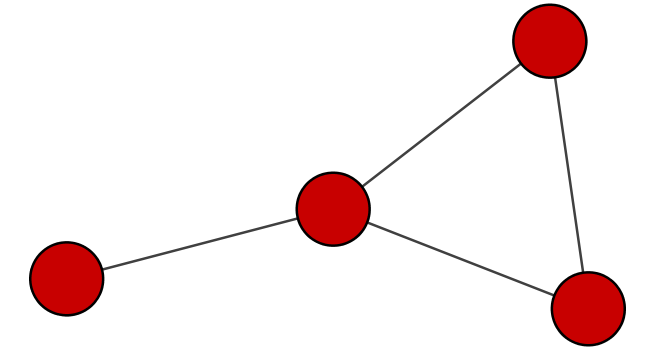
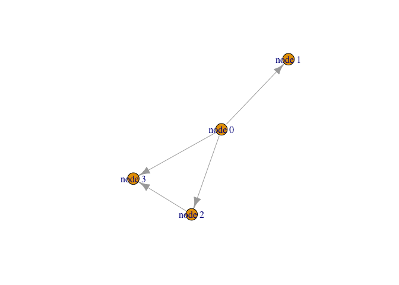

Class 17 Biological Network Analysis
================
Darren Lam
11/19/2019

# Introduction to driving Cytoscape through R

Setting up required packages

``` r
#BiocManager::install("RCy3")
#install.packages("igraph")
#install.packages("RColorBrewer")

library("RCy3")
library("igraph")
```

    ## 
    ## Attaching package: 'igraph'

    ## The following objects are masked from 'package:stats':
    ## 
    ##     decompose, spectrum

    ## The following object is masked from 'package:base':
    ## 
    ##     union

``` r
library("RColorBrewer")
```

Checking our Cytoscape connection

``` r
cytoscapePing()
```

    ## [1] "You are connected to Cytoscape!"

``` r
cytoscapeVersionInfo()
```

    ##       apiVersion cytoscapeVersion 
    ##             "v1"          "3.7.2"

Sending a small network to Cytoscape

``` r
g <- makeSimpleIgraph()
createNetworkFromIgraph(g, "myGraph")
```

    ## Loading data...
    ## Applying default style...
    ## Applying preferred layout...

    ## networkSUID 
    ##        2708

Including Cyctoscape-rendered image in R Markdown

``` r
fig <- exportImage(filename="demo", type="png", height=350)
```

    ## Warning: This file already exists. A Cytoscape popup 
    ##                 will be generated to confirm overwrite.

``` r
 #displayed below in R Markdown report
```

<!-- -->

Changing network style in Cytoscape

``` r
setVisualStyle("Marquee")
```

    ##                 message 
    ## "Visual Style applied."

Creating a basic plot of our network in R

``` r
plot(g)
```

<!-- -->

# Reading our metagenomics data into Cytoscape through R

Reading in data from
worksheet

``` r
prok_vir_cor <- read.delim("virus_prok_cor_abundant.tsv", stringsAsFactors = F)

head(prok_vir_cor)
```

    ##       Var1          Var2    weight
    ## 1  ph_1061 AACY020068177 0.8555342
    ## 2  ph_1258 AACY020207233 0.8055750
    ## 3  ph_3164 AACY020207233 0.8122517
    ## 4  ph_1033 AACY020255495 0.8487498
    ## 5 ph_10996 AACY020255495 0.8734617
    ## 6 ph_11038 AACY020255495 0.8740782

Creating an igraph object from our pata frame

``` r
g <- graph.data.frame(prok_vir_cor, directed = F)

class(g) # checking that we created an igraph object
```

    ## [1] "igraph"

``` r
g # viewing our igraph object
```

    ## IGRAPH de02b34 UNW- 845 1544 -- 
    ## + attr: name (v/c), weight (e/n)
    ## + edges from de02b34 (vertex names):
    ##  [1] ph_1061 --AACY020068177 ph_1258 --AACY020207233
    ##  [3] ph_3164 --AACY020207233 ph_1033 --AACY020255495
    ##  [5] ph_10996--AACY020255495 ph_11038--AACY020255495
    ##  [7] ph_11040--AACY020255495 ph_11048--AACY020255495
    ##  [9] ph_11096--AACY020255495 ph_1113 --AACY020255495
    ## [11] ph_1208 --AACY020255495 ph_13207--AACY020255495
    ## [13] ph_1346 --AACY020255495 ph_14679--AACY020255495
    ## [15] ph_1572 --AACY020255495 ph_16045--AACY020255495
    ## + ... omitted several edges

``` r
# "UNW- 854 1544 -" tells us our network graph has 845 verticies and 1544 edges
```
